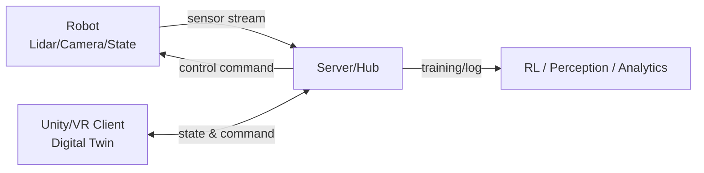

# [캡스톤] 디지털 트윈 기반 로봇-인간 상호작용 시뮬레이션 및 제어 시스템

## 0. 이번주 해야 할 일 (역할 분담)
> 목표: **프로젝트 “틀(프레임)” 확정 + 최소 동작 프로토타입(MVP) 착수**  
> 원칙: **각 파트 리더(팀장)는 이번주 산출물의 내용 확인/정합성 검증 책임**을 가짐.

### 이번주 공통 산출물(필수)
- [ ] 시스템 전체 **데이터 흐름**(Robot → Server → Unity/VR → Server → Robot) 1장 요약
- [ ] **메시지/토픽 규격 초안**(필드 정의, 주기, 단위, 좌표계) 작성
- [ ] Unity 시뮬레이터와 서버 간 **1회 왕복 통신 데모**(더미 데이터 OK)
- [ ] 장애물(Obstacle) 객체 **표준 스키마** 정의(위치/크기/타입/신뢰도/타임스탬프 등)
- [ ] “틀” 세부사항 확정(아래 ‘틀에 대한 세부사항 파악’ 참고)

### 개인별 To-Do
- **잔나영 (AI/Perception & Robot Compute, 파트 리더)**
  - [ ] 장애물 인식 파이프라인 후보 선정(카메라/라이다) + 입력/출력 스펙 정리
  - [ ] 장애물 타입 분류 기준(정적/동적/사람/차량/임의물체) 정의
  - [ ] 서버로 전달할 **ObstacleList 메시지 형식** 초안 작성
  - [ ] 실시간 연산 제약(프레임/지연/리소스) 가정치 정리

- **조병현, 김현우 (Unity 디지털 트윈/가상환경, 파트 리더: 조병현)**
  - [ ] 현실-가상 좌표계 매핑 규칙(원점/축/단위) 초안
  - [ ] Unity 씬 기본 구성(지면/장애물 프리팹/로봇 프리팹) 1차 버전
  - [ ] 서버에서 받은 로봇 상태/장애물 정보를 **가상 객체로 반영**(더미 수신 OK)
  - [ ] VR 상호작용 최소 시나리오 1개 정의(예: 사용자 접근/회피 반응 기록)

- **이대규 (Server/Client-Server 연동 & Interaction, 파트 리더)**
  - [ ] 서버 통신 구조 결정(WebSocket/ROS bridge/REST 보조) 및 라우팅 설계
  - [ ] Unity ↔ Server **실시간 동기화 채널**(publish/subscribe) 구현 초안
  - [ ] 로그/리플레이를 위한 데이터 저장 포맷(JSONL/ROS bag 등) 제안
  - [ ] 지연 측정(핑/RTT) 기본 측정 코드/방법 정리

- **오필승 (Robot Service & UI/UX 이슈, 파트 리더)**
  - [ ] 연령대(청소년/성인/고령자)별 UI 접근성 이슈 체크리스트 작성
  - [ ] 로봇 서비스 시나리오(안내/배송/경고 등) 2~3개 정의
  - [ ] 실생활 적용 시 고려사항(법/안전/개인정보/윤리) 리스크 목록화
  - [ ] 충돌/근접 경고 시 UI/알림 프로토콜 초안 제안

---

## 0.1 틀에 대한 세부사항 파악 (이번주에 반드시 결정)
- [ ] 좌표계/단위(예: ROS ENU vs Unity 좌표, m ↔ unit 스케일)
- [ ] 시간 동기화(타임스탬프 기준, 보간/예측 방식)
- [ ] 통신 프로토콜(WS/ROS2/DDS 등) 및 메시지 버전 규칙
- [ ] 디지털 트윈 환경 구성 방식(실제 지도/도면/직접 모델링)
- [ ] 장애물 정의(클래스, 크기, 속도, 불확실성 표현)
- [ ] 안전 프로토콜(정지 조건, 사람 접근 임계값, emergency stop)
- [ ] 실험 지표(지연, 충돌률, 경로 효율, 상호작용 만족도 등)

---

## 1. 프로젝트 배경 및 목표
- **문제 의식**: 물류 로봇의 실제 도로(인도, 차도) 주행은 법적 규제와 돌발 상황(인명 사고 등)으로 인해 현실적 실험이 어려움.
- **해결 방안**: Unity 3D 기반 가상 환경에 현실 공간을 복제(Digital Twin)하여 VR을 통한 상호작용 실험 및 강화학습을 진행.
- **핵심 목표**: 가상 공간의 시뮬레이션 결과와 현실 로봇의 동작을 **실시간 동기화**하고, 최적의 이동 경로 및 상호작용 로직 도출.

---

## 2. 시스템 아키텍처
본 프로젝트는 **로봇-서버-게임(유니티/VR) 클라이언트**가 유기적으로 연결된 3단 구조로 설계됩니다.

### A. Front-end (Game & Virtualization)
- **Unity 3D 환경 구축**: 현실의 물리 법칙이 적용된 가상 공간 개발
- **실시간 동기화**: 로봇의 센서/상태 데이터를 받아 가상 객체 업데이트
- **사용자 경험(VR)**: VR 기기를 활용해 가상의 로봇과 상호작용하는 인간 반응 측정

### B. Back-end (Server & AI)
- **데이터 허브**: 로봇 센서 데이터와 게임 클라이언트 데이터를 통합 수집 및 전송
- **강화학습(RL)**: 현실과 가상의 차이(Gap)를 줄이고, 장애물 회피 및 최적 경로 학습
- **제어 알고리즘**: 시뮬레이션된 최적 움직임을 실제 로봇에 명령 하달

### C. Hardware (Robot & Sensing)
- **물류 로봇**: 센싱(Lidar, Camera) 정보를 서버로 전송하고 서버의 명령에 따라 구동

---

## 3. 핵심 연구 및 개발 내용
1) **충돌 및 상호작용 처리**
- 현실의 돌발 장애물 인식 및 가상 공간 즉시 복제
- 사람과의 충돌 시뮬레이션 및 안전 프로토콜 수립

2) **심리스(Seamless) 동기화**
- 로봇-서버-클라이언트 간 **저지연(Low Latency)** 데이터 통신
- 지연/패킷 손실 상황에서의 보간/예측/재동기화 전략

3) **정책 및 환경 시뮬레이션**
- 로봇 전용 도로 vs 인도 vs 차도 등 도시 정책 적용에 따른 효율성 검증

---

## 4. 팀 구성 및 역할 (총 5명)
| 구성원 | 역할/담당 | 기술 스택(예시) | 파트 리더 |
| :--- | :--- | :--- | :---: |
| **잔나영** | AI를 통한 장애물 파악 및 로봇 연산 | Python, PyTorch, ROS(옵션), OpenCV | ✅ |
| **조병현** | Unity 기반 현실-가상 동기화 디지털 트윈 환경 제작(공동) | Unity, C#, (XR/VR SDK) | ✅ |
| **김현우** | Unity 기반 실시간 처리 무대(씬/상호작용) 제작(공동) | Unity, C#, (XR/VR SDK) |  |
| **이대규** | 가상환경 ↔ 클라이언트/서버 연동 및 전체 상호작용 설계 | WebSocket, Python/Node, ROS bridge | ✅ |
| **오필승** | 로봇 서비스 시나리오 및 연령별 UI 이슈/실생활 적용 고려사항 | UX 리서치, HCI, 가이드라인 정리 | ✅ |

> **리더 책임(이번주부터 상시 적용)**  
> - 산출물(문서/코드)의 **내용 검증**, 인터페이스 일관성 체크, PR/리뷰 주도  
> - 다른 파트와의 **의존성/충돌 요소 조기 발견** 및 해결 주도

---

## 5. 개발 일정 (25년 겨울방학)
- **Phase 1 (겨울방학)**: 프로토타입 개발 및 기초 시뮬레이션 환경 구축  
  - (예) 통신 파이프라인 구축 → 디지털 트윈 씬 구성 → 최소 상호작용 시나리오 → 초기 RL/회피 정책 실험

---

## 6. 협업 규칙(권장)
- 브랜치: `main`(안정) / `dev`(통합) / `feature/*`(기능)
- 문서: `/docs` 폴더에 아키텍처/메시지 스펙/실험 기록 정리
- 이슈/회의: 주 1회 주간 회의 + 필요 시 파트별 짧은 싱크

---

## 7. (추가 예정) 실행 방법
- 서버 실행 방법 / Unity 실행 방법 / 로봇 연동 방법은 통신 스펙 확정 후 업데이트합니다.
