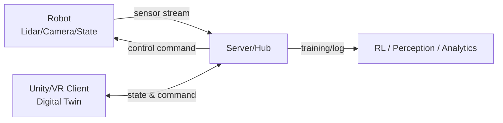

# [캡스톤] 디지털 트윈 기반 로봇-인간 상호작용 시뮬레이션 및 제어 시스템

## 0. 이번주 해야 할 일 (역할 분담)
> 목표: **프로젝트 “틀(프레임)” 확정 + 최소 동작 프로토타입(MVP) 착수**  
> 원칙: **각 파트 리더(팀장)는 이번주 산출물의 내용 확인/정합성 검증 책임**을 가짐.

### 이번주 공통 산출물
- [ ] Robomaster S1을 이용하여 python으로 어디까지 조작이 가능한지 파악하는 것

### 개인별 To-Do
- **진나영 (AI/Perception & Robot Compute, 파트 리더)**
    - ex) 장애물 인식 파이프라인 후보 선정(카메라/라이다) + 입력/출력 스펙 정리

- **조병현, 김현우 (Unity 디지털 트윈/가상환경, 파트 리더: 주마다 변경)**
    - ex) 현실-가상 좌표계 매핑 규칙(원점/축/단위) 초안

- **이대규 (Server/Client-Server 연동 & Interaction, 파트 리더)**
    - ex) 서버 통신 구조 결정(WebSocket/ROS bridge/REST 보조) 및 라우팅 설계
    - 
- **오필승 (Robot Service & UI/UX 이슈, 파트 리더)**
    - ex) 연령대(청소년/성인/고령자)별 UI 접근성 이슈 체크리스트 작성

---

## 0.1 틀에 대한 세부사항 파악
- [ ] 좌표계/단위(예: ROS ENU vs Unity 좌표, m ↔ unit 스케일)
- [ ] 시간 동기화(타임스탬프 기준, 보간/예측 방식)
- [ ] 통신 프로토콜(WS/ROS2/DDS 등) 및 메시지 버전 규칙
- [ ] 디지털 트윈 환경 구성 방식(실제 지도/도면/직접 모델링)
- [ ] 장애물 정의(클래스, 크기, 속도, 불확실성 표현)
- [ ] 안전 프로토콜(정지 조건, 사람 접근 임계값, emergency stop)
- [ ] 실험 지표(지연, 충돌률, 경로 효율, 상호작용 만족도 등)

---

## 1. 프로젝트 배경 및 목표
- **문제 의식**: 물류 로봇의 실제 도로(인도, 차도) 주행은 법적 규제와 돌발 상황(인명 사고 등)으로 인해 현실적 실험이 어려움.
- **해결 방안**: Unity 3D 기반 가상 환경에 현실 공간을 복제(Digital Twin)하여 VR을 통한 상호작용 실험 및 강화학습을 진행.
- **핵심 목표**: 가상 공간의 시뮬레이션 결과와 현실 로봇의 동작을 **실시간 동기화**하고, 최적의 이동 경로 및 상호작용 로직 도출.

---

## 1.1 1차 목표 (복도 PoC: End-to-End 주행 + 섹션 기반 상호작용)
### 목표 요약
- **공간**: “복도” 환경(끝에서 끝까지)
- **로봇**: **RoboMaster S1**
- **제어**: **Python**으로 주행 제어(기본 주행/정지/속도/방향)
- **엣지 노드**: 복도를 **여러 섹션(section)** 으로 분할하고, 각 섹션에 **Raspberry Pi**를 배치
- **핵심 상호작용 요구**
    - 로봇이 어떤 섹션에 **진입하면 해당 섹션의 RPi가 로봇과 “연결(connect)”**
    - 로봇이 섹션에서 **이탈하면 “연결 해제(disconnect)”**
    - 메인 서버는 각 RPi로부터 **연결/해제 이벤트 및 상태 정보를 수신**하여 전체 진행 상황을 추적
    - 마지막으로 끊긴 시점(Last Disconnect / Last Seen)의 정보는 **RPi가 보관/전달**하고, 서버가 최종 수집

### “섹션 핸드오프” 동작 규칙(초안)
- **단일 섹션 단일 소유권**: 같은 시간에 로봇은 오직 1개 섹션 RPi와만 “Active Connection”
- **연결 전환 방식**: `섹션 i Disconnect → 섹션 i+1 Connect` 순서를 기본으로 하되, 지연/실패 시 재시도 규칙 필요
- **서버 관점 상태**
    - `current_section`: 현재 섹션 ID
    - `last_seen_rpi`: 마지막으로 보고한 RPi ID
    - `last_disconnect`: 마지막 disconnect 이벤트(시간/좌표/속도/배터리 등)
    - `mission_progress`: 시작~종료 구간 진행률(%) 또는 체크포인트

### 최소 메시지(이벤트) 정의(예시)
- `SECTION_ENTER` : 로봇이 섹션에 진입(섹션ID, 로봇ID, timestamp, pose)
- `SECTION_EXIT`  : 로봇이 섹션에서 이탈(섹션ID, 로봇ID, timestamp, pose)
- `RPi_CONNECT` / `RPi_DISCONNECT` : RPi가 로봇과 연결/해제(성공/실패, 이유코드 포함)
- `LAST_SEEN_SNAPSHOT` : 마지막 끊김 시점 스냅샷(최소 pose, 속도, 배터리, 섹션ID)

---

## 2. 시스템 아키텍처
본 프로젝트는 **로봇-서버-게임(유니티/VR) 클라이언트**가 유기적으로 연결된 3단 구조로 설계됩니다.

### A. Front-end (Game & Virtualization)
- **Unity 3D 환경 구축**: 현실의 물리 법칙이 적용된 가상 공간 개발
- **실시간 동기화**: 로봇의 센서/상태 데이터를 받아 가상 객체 업데이트
- **사용자 경험(VR)**: VR 기기를 활용해 가상의 로봇과 상호작용하는 인간 반응 측정

### B. Back-end (Server & AI)
- **데이터 허브**: 로봇 센서 데이터와 게임 클라이언트 데이터를 통합 수집 및 전송
- **강화학습(RL)**: 현실과 가상의 차이(Gap)를 줄이고, 장애물 회피 및 최적 경로 학습
- **제어 알고리즘**: 시뮬레이션된 최적 움직임을 실제 로봇에 명령 하달

### C. Hardware (Robot & Sensing)
- **물류 로봇**: 센싱(Lidar, Camera) 정보를 서버로 전송하고 서버의 명령에 따라 구동

---

## 3. 핵심 연구 및 개발 내용
1) **충돌 및 상호작용 처리**
- 현실의 돌발 장애물 인식 및 가상 공간 즉시 복제
- 사람과의 충돌 시뮬레이션 및 안전 프로토콜 수립

2) **심리스(Seamless) 동기화**
- 로봇-서버-클라이언트 간 **저지연(Low Latency)** 데이터 통신
- 지연/패킷 손실 상황에서의 보간/예측/재동기화 전략

3) **정책 및 환경 시뮬레이션**
- 로봇 전용 도로 vs 인도 vs 차도 등 도시 정책 적용에 따른 효율성 검증

---

## 4. 팀 구성 및 역할 (총 5명)
| 구성원 | 역할/담당 | 기술 스택(예시) | 파트 리더 |
| :--- | :--- | :--- |:----:|
| **진나영** | AI를 통한 장애물 파악 및 로봇 연산 | Python, PyTorch, ROS(옵션), OpenCV |      |
| **조병현** | Unity 기반 현실-가상 동기화 디지털 트윈 환경 제작(공동) | Unity, C#, (XR/VR SDK) |      |
| **김현우** | Unity 기반 실시간 처리 무대(씬/상호작용) 제작(공동) | Unity, C#, (XR/VR SDK) |      |
| **이대규** | 가상환경 ↔ 클라이언트/서버 연동 및 전체 상호작용 설계 | WebSocket, Python/Node, ROS bridge |      |
| **오필승** | 로봇 서비스 시나리오 및 연령별 UI 이슈/실생활 적용 고려사항 | UX 리서치, HCI, 가이드라인 정리 |      |

> **리더 책임(이번주부터 상시 적용)**
> - 산출물(문서/코드)의 **내용 검증**, 인터페이스 일관성 체크, PR/리뷰 주도
> - 다른 파트와의 **의존성/충돌 요소 조기 발견** 및 해결 주도

---

## 5. 개발 일정 (25년 겨울방학)
- **Phase 1 (겨울방학)**: 프로토타입 개발 및 기초 시뮬레이션 환경 구축
    - (예) 통신 파이프라인 구축 → 디지털 트윈 씬 구성 → 최소 상호작용 시나리오 → 초기 RL/회피 정책 실험

---

## 6. 협업 규칙(권장)
- 브랜치: `main`(안정) / `dev`(통합) / `feature/*`(기능)
  - 각 분야(파트)별 업데이트 진행 시, 새로운 `feature/*` 브랜치를 생성하여 작업
  - 최종 컨펌은 해당 파트의 리더가 PR을 검토 및 승인하여 `dev` 브랜치로 머지
- 문서: `/docs` 폴더에 아키텍처/메시지 스펙/실험 기록 정리
- 이슈/회의: 주 1회 주간 회의 + 필요 시 파트별 짧은 싱크

---

## 7. (추가 예정) 실행 방법
- 서버 실행 방법 / Unity 실행 방법 / 로봇 연동 방법은 통신 스펙 확정 후 업데이트합니다.

## 8. 실생활 적용 가능성
해당 기술이 실생활에 적용된다면 어떤 방식으로 적용될지를 파악했다.

### 8.1. 자율 배송 시스템 (Delivery Robot System)

####  개요
현재 상용화된 서빙·배송 로봇은 제한된 환경과 고정된 경로를 기반으로 동작한다.  
본 프로젝트는 **실시간 환경 인식 + 디지털 트윈 기반 경로 판단**을 통해 보다 유연한 이동을 가능하게 한다.

####  적용 방식
- 로봇이 **실시간으로 주변 환경(사람, 장애물, 공간 구조)** 인식
- 디지털 트윈 상에서 경로를 재계산 후 실제 로봇에 반영
- 복도·구역 단위로 나뉜 환경에서 **섹션 기반 이동 제어**

#### 기대 효과
- 기존 고정 경로 기반 로봇 대비 **유연한 이동**
- 사람과의 충돌 위험 감소
- 병원, 학교, 사무실 등 실내 환경에 적합

---

### 8.2. 정밀 이동 제어 (사람 대비 장점)

####  기존 방식의 한계
- 수동 조작 시 반응 지연 발생
- 장시간 운용 시 피로 누적 및 판단 오류
- 반복 작업에서 정확도 저하

####  본 시스템의 강점
- 센서 + 알고리즘 기반 판단으로 **일관된 이동 품질 유지**
- 디지털 트윈을 활용한 **경로 예측 및 검증**
- 다수 로봇 동시 운용 시에도 충돌 최소화

**사람보다 안정적이고 반복 정밀도가 높은 이동 제어 가능**

---

### 8.3. 거동이 불편한 사용자를 위한 이동 보조 시스템

#### 적용 시나리오
- 병원, 요양시설, 공공기관 등에서 이동 보조
- 사용자의 이동 속도에 맞춰 동행하거나 목적지까지 안내

#### 기술 요소
- 사람 위치 및 이동 속도 인식
- 일정 거리 유지 및 위험 감지
- 필요 시 자동 정지 또는 우회

#### 기대 효과
- 이동 약자의 자율성 향상
- 보호자 부담 감소
- 안전한 실내 이동 환경 제공

---

### 8.4. 재난 및 위험 지역 탐색 시스템

#### 적용 환경
- 화재, 붕괴, 연기, 유독가스 등 위험 지역
- 사람이 직접 진입하기 어려운 공간

#### 활용 방식
- 로봇 선행 투입 → 환경 정보 수집
- 디지털 트윈 상에서 상황 시각화
- 안전한 진입 경로 및 대응 전략 수립

#### 효과
- 인명 피해 최소화
- 구조 전략 사전 검증 가능
- 반복 시뮬레이션을 통한 대응 최적화

---

### 8.5. 스마트 시티 확장 가능성

#### 개념
도시 전체를 디지털 트윈으로 구성하고,  
로봇을 **이동형 센서 노드**로 활용하는 구조

#### 적용 예시
- 도로·보행자 밀집도 분석
- 공공시설 상태 모니터링
- 실시간 도시 상황 인지 및 대응

#### 기대 효과
- 도시 운영 효율 극대화
- 교통·안전·에너지 관리 자동화
- 미래형 스마트 시티 기반 기술 확보

---

### 종합 정리

> 본 프로젝트는 단순한 로봇 제어를 넘어  
> **디지털 트윈 + 분산 제어 + 인간 중심 설계**를 결합한  
> 실사용 가능한 차세대 로봇 시스템을 목표로 한다.

#### 핵심 가치 요약
- ✔ 실내 자율 이동 및 환경 인식  
- ✔ 인간-로봇 상호작용(HRI) 강화  
- ✔ 재난 대응 및 공공 인프라 적용 가능  
- ✔ 스마트 시티 확장성 확보  
